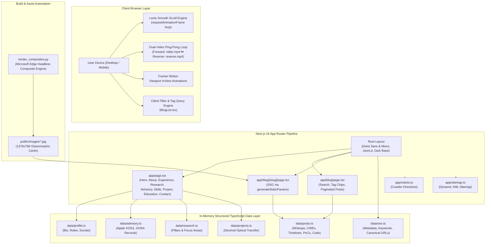

# 🛡️ Madhan Alagarsamy — Production Technical Portfolio & Security Research Writelog

<div align="center">

[](https://madhanalagarsamy.site)
[](https://nextjs.org/)
[](https://react.dev/)
[](https://www.typescriptlang.org/)
[](https://tailwindcss.com/)
[](https://github.com/darkroomengineering/lenis)
[](https://www.framer.com/motion/)
[](LICENSE)

**Official Technical Portfolio, Engineering Showcase, and Security Advisory Writelog of [Madhan Alagarsamy (MADHAN A)](https://github.com/madhanalagarsamy)**  
*Independent Cybersecurity Researcher · Software Developer · Founder of Net Corporation*

[🌐 Live Production Website](https://madhanalagarsamy.site) • [📝 Security Research Blog](https://madhanalagarsamy.site/blog) • [🔒 Verified Advisories](https://madhanalagarsamy.site/#advisory) • [📖 Architecture Manual](docs/ARCHITECTURE.md)

</div>

---

## 📑 Table of Contents

- [Executive Summary](#-executive-summary)
- [System Architecture](#-system-architecture)
- [Technology Matrix](#-technology-matrix)
- [Key Engineering Innovations](#-key-engineering-innovations)
  - [1. Dual-Video Ping-Pong Background Engine](#1-dual-video-ping-pong-background-engine)
  - [2. Lenis Hardware-Accelerated Smooth Scrolling](#2-lenis-hardware-accelerated-smooth-scrolling)
  - [3. Static Site Generation (SSG) with Dynamic Static Params](#3-static-site-generation-ssg-with-dynamic-static-params)
  - [4. Real-Time Client Search & Tag Filtering Engine](#4-real-time-client-search--tag-filtering-engine)
  - [5. Full-Spectrum Schema.org JSON-LD Engine](#5-full-spectrum-schemaorg-json-ld-engine)
  - [6. Automated Headless Composite Card Renderer](#6-automated-headless-composite-card-renderer)
- [Repository Structure](#-repository-structure)
- [Getting Started](#-getting-started)
  - [Prerequisites](#prerequisites)
  - [Installation](#installation)
  - [Development Server](#development-server)
  - [Production Build & Verification](#production-build--verification)
- [Content Authoring & Data Schemas](#-content-authoring--data-schemas)
- [Production Deployment Runbook](#-production-deployment-runbook)
  - [Vercel Deployment (Recommended)](#vercel-deployment-recommended)
  - [Docker Containerization](#docker-containerization)
  - [Self-Hosted PM2 / Node.js](#self-hosted-pm2--nodejs)
- [SEO, Web Vitals & Compliance](#-seo-web-vitals--compliance)
- [Documentation Index](#-documentation-index)
- [Security & Disclosure Policy](#-security--disclosure-policy)
- [Author & Connect](#-author--connect)

---

## 🔭 Executive Summary

This repository houses the source code for the official web platform of **Madhan Alagarsamy**, hosted globally at [`https://madhanalagarsamy.site`](https://madhanalagarsamy.site). 

Designed with an ultra-dark terminal aesthetic and cinematic motion design, the platform bridges two critical technical disciplines:
1. **Defensive Cybersecurity & Vulnerability Research**: In-depth technical disclosures, verified CVE/GHSA advisories (including Apple container DoS `#2261`, GitHub Security Advisories `GHSA-8rfq-rmx4-8qhr`, `GHSA-x3cj-mm38-329g`, BigBlueButton IDOR `GHSA-9v52-vhvw-4w5c`), and offensive attack surface analyses.
2. **High-Performance Software Engineering**: Scalable enterprise web systems, high-concurrency architectures, WebAssembly algorithms (such as the *Decimal Optical Transfer* screen-to-camera optical transmission protocol), and modern frontend ergonomics.

Built on **Next.js 16 (App Router)** and **React 19**, the platform delivers **100% static pre-rendering (SSG)** across all writeups, zero client-server runtime waterfall, hardware-accelerated dual-video canvas backgrounds, and sub-millisecond route transitions.

---

## 🏛 System Architecture

The following diagram illustrates the component architecture, data flow, and rendering pipeline:



---

## ⚡ Technology Matrix

| Layer / Subsystem | Technology | Version | Purpose & Rationale |
| :--- | :--- | :--- | :--- |
| **Framework** | [Next.js](https://nextjs.org/) | `16.3.4` | App Router, React Server Components (RSC), Turbopack compilation, dynamic SSG. |
| **UI Library** | [React](https://react.dev/) | `19.2.8` | Latest React 19 concurrent features, streaming rendering, zero runtime overhead. |
| **Language** | [TypeScript](https://www.typescriptlang.org/) | `^5.0.0` | Strict type checking across all data layers, props, and schemas. |
| **Styling Engine** | [Tailwind CSS](https://tailwindcss.com/) | `^4.0.0` | Next-gen CSS-first `@import "tailwindcss"` engine with zero postcss config clutter. |
| **Smooth Scrolling**| [Lenis](https://github.com/darkroomengineering/lenis) | `^1.3.26` | Physics-based normalized vertical scroll with touch and reduced-motion support. |
| **Motion & Gestures**| [Framer Motion](https://www.framer.com/motion/) | `^13.2.0` | Hardware-accelerated viewport-triggered reveals, spring transitions, and mobile menu gestures. |
| **Iconography** | [Lucide React](https://lucide.dev/) | `^1.41.0` | Tree-shakable terminal, security, and developer icons. |
| **Fonts** | `next/font/google` | Built-in | Variable fonts: **Geist** (editorial body) & **Geist Mono** (code / terminal badges). |
| **Automation** | Python + Edge CLI | `3.10+` | Custom composite banner generator for high-res social and article cover graphics. |
| **Code Quality** | ESLint & Config Next | `^9.0.0` | Enforces strict accessibility, React rules of hooks, and Next.js best practices. |

---

## 💡 Key Engineering Innovations

### 1. Dual-Video Ping-Pong Background Engine
Located in [`components/CinematicVideo.tsx`](components/CinematicVideo.tsx):
- **Problem**: Standard looping video backgrounds suffer from a visible abrupt jump when rewinding to time `0:00`.
- **Solution**: The engine mounts two synchronized `<video>` elements:
  - `video1` plays forward (`/video.mp4`).
  - `video2` plays backward (`/reverse.mp4`).
- **Ping-Pong Loop**: When `video1` triggers `onEnded`, `video2` is rewound to `0` and played, while CSS opacity fades between them in 700ms (`transition-opacity duration-700`). When `video2` finishes, control hands back to `video1`.
- **Autoplay Defense**: On mobile platforms with strict autoplay restrictions, the engine gracefully catches the rejected `video.play()` promise and attaches one-time passive listeners to `touchstart`, `scroll`, and `click` to seamlessly initiate playback upon the user's first gesture without crashing or displaying play controls.

### 2. Lenis Hardware-Accelerated Smooth Scrolling
Located in [`components/SmoothScroll.tsx`](components/SmoothScroll.tsx):
- Synchronizes scrolling physics with the browser's display refresh rate via `requestAnimationFrame(raf)`.
- Automatically respects accessibility preferences: detects `prefers-reduced-motion: reduce` and completely bypasses interpolation for sensitive users.
- Custom easing formula: `(t) => Math.min(1, 1.001 - Math.pow(2, -10 * t))`.

### 3. Static Site Generation (SSG) with Dynamic Static Params
Located in [`app/blog/[slug]/page.tsx`](app/blog/[slug]/page.tsx):
- Implements `generateStaticParams()` to pre-render every single vulnerability writeup at build time into pure HTML.
- Employs Next.js 16 dynamic parameter unwrapping: `const { slug } = await params`.
- Guaranteed `O(1)` TTFB (Time To First Byte) served directly from edge CDN cache nodes without running database queries on requests.

### 4. Real-Time Client Search & Tag Filtering Engine
Located in [`components/BlogList.tsx`](components/BlogList.tsx):
- In-memory instant client search across:
  - Post Title
  - Executive Summary
  - Category & Arbitrary Topic Tags
  - Official Advisory IDs (e.g., `GHSA`, `CVE`, `apple/container#2261`)
- Dynamic Tag Cloud with real-time active counter (`SHOWING X OF Y ARTICLES`).

### 5. Full-Spectrum Schema.org JSON-LD Engine
Located in [`components/JsonLd.tsx`](components/JsonLd.tsx):
- Injects validated JSON-LD schema into the document `<head>`:
  - **Person Schema**: Detailed identity graph for Madhan Alagarsamy, including aliases (`MADHAN A`), organization (`Net Corporation`), and direct links to discovered advisories.
  - **WebSite & ProfilePage Schema**: Provides rich search engine indexation.
  - **TechArticle & BlogPosting Schema**: Embedded in every research post, indexing CWE numbers, advisory IDs, affected software packages, code blocks, and dates.
  - **BreadcrumbList Schema**: Enables Google breadcrumb navigation in search result snippets.

### 6. Automated Headless Composite Card Renderer
Located in [`render_composites.py`](render_composites.py):
- High-resolution (1376x768) image compositor using Microsoft Edge Headless CLI.
- Dynamically blends raw terminal telemetry, CWE pills, target repository tags, and security advisories into dark glassmorphic social preview images (`public/images/*.jpg`).

---

## 📂 Repository Structure

```text
portfolio/
├── .github/                      # CI/CD workflows and automated checks
├── app/                          # Next.js 16 App Router hierarchy
│   ├── favicon.ico               # Portfolio browser favicon
│   ├── globals.css               # Tailwind CSS v4 root stylesheet & Lenis resets
│   ├── layout.tsx                # Root layout, Geist font definitions & global JSON-LD
│   ├── page.tsx                  # Single-page journey (Hero through Contact)
│   ├── robots.ts                 # Dynamic robots.txt metadata route
│   ├── sitemap.ts                # Dynamic XML sitemap generator
│   └── blog/                     # Security Research Blog subsystem
│       ├── page.tsx              # Research blog index with interactive search
│       └── [slug]/
│           └── page.tsx          # Dynamic SSG writeup page with TechArticle schema
├── components/                   # Reusable, typed React UI components
│   ├── About.tsx                 # 4-pillar narrative & technical identity
│   ├── BlogList.tsx              # Interactive search & filterable post list
│   ├── CinematicVideo.tsx        # Dual-video forward/reverse ping-pong canvas
│   ├── Contact.tsx               # Direct contact channels & security desk
│   ├── Education.tsx             # Academic credentials (MCA & BCA)
│   ├── Experience.tsx            # Founder & Research career timeline
│   ├── FeaturedProject.tsx       # Decimal Optical Transfer deep dive
│   ├── Footer.tsx                # Terminal-styled footer & status ping
│   ├── Hero.tsx                  # High-impact typographic hero section
│   ├── JsonLd.tsx                # Safe Schema.org JSON-LD script injector
│   ├── Navigation.tsx            # Sticky blurred navbar with smooth hash linking
│   ├── SecurityAdvisory.tsx      # Verified GitHub & Apple advisories showcase
│   ├── SecurityResearch.tsx      # VAPT, open-source patches, and code review
│   ├── Skills.tsx                # 5-tier technical skill categorization
│   ├── SmoothScroll.tsx          # Lenis physics-based scroll provider
│   └── icons/
│       └── GithubIcon.tsx        # Monochromatic GitHub SVG icon
├── data/                         # Single source of truth data layer
│   ├── advisory.ts               # Verified CVE/GHSA advisories & 4-step process
│   ├── education.ts              # University degrees and affiliations
│   ├── experience.ts             # Professional roles and responsibilities
│   ├── posts.ts                  # In-depth security research writeups & PoCs
│   ├── profile.ts                # Author bio, titles, email, and social links
│   ├── projects.ts               # Featured engineering project details
│   ├── research.ts               # Security research pillars and targets
│   ├── seo.ts                    # Central SEO config, keywords, and URLs
│   └── skills.ts                 # Categorized technical abilities
├── docs/                         # Production Documentation Suite
│   ├── ARCHITECTURE.md           # System architecture & rendering lifecycle
│   ├── COMPONENTS.md             # Complete component catalog & API reference
│   ├── CONTENT_AUTHORING.md      # Guide for adding posts, advisories & projects
│   ├── DEPLOYMENT_RUNBOOK.md     # Production deployment to Vercel, Docker & PM2
│   └── SEO_AND_STRUCTURED_DATA.md# Rich results, Schema.org & crawl verification
├── public/                       # Static public assets
│   ├── reverse.mp4               # Reverse motion background video (1.8 MB)
│   ├── video.mp4                 # Forward motion background video (1.9 MB)
│   └── images/                   # High-res research composite cards
├── AGENTS.md                     # Agent conventions and Next.js instructions
├── eslint.config.mjs             # ESLint 9 configuration
├── next.config.ts                # Next.js 16 compiler configuration
├── package.json                  # Dependencies, scripts, and package metadata
├── postcss.config.mjs            # PostCSS configuration for Tailwind CSS v4
├── render_composites.py          # Python headless Edge composite card renderer
├── SECURITY.md                   # Coordinated Vulnerability Disclosure (CVD) policy
└── tsconfig.json                 # TypeScript strict configuration & path aliases
```

---

## 🚀 Getting Started

### Prerequisites

Ensure you have the following installed on your local environment:
- **Node.js**: `v20.9.0` or higher (Node `v22+` or `v24+` recommended)
- **Package Manager**: `npm` (v10+), `pnpm` (v9+), or `yarn` (v1.22+)
- **Git**: `2.30+`
- **Python** *(optional, only if generating composite cards)*: `3.10+` with Microsoft Edge installed.

### Installation

1. **Clone the repository:**
   ```bash
   git clone https://github.com/madhanalagarsamy/portfolio.git
   cd portfolio
   ```

2. **Install dependencies:**
   ```bash
   npm install
   ```

### Development Server

Start the local development server with Turbopack acceleration:

```bash
npm run dev
```

Open [http://localhost:3000](http://localhost:3000) in your browser. The page hot-reloads automatically as you edit files in `app/`, `components/`, or `data/`.

### Production Build & Verification

To verify that all TypeScript types, ESLint rules, and static pages compile cleanly:

```bash
# 1. Run ESLint checks
npm run lint

# 2. Compile production build (SSG page generation)
npm run build

# 3. Preview production build locally
npm run start
```

---

## 📝 Content Authoring & Data Schemas

The entire site is powered by a type-safe data layer located in `data/`. No external CMS database is required.

- **To update personal details, title, or biography**: Edit [`data/profile.ts`](data/profile.ts).
- **To add a verified Security Advisory**: Edit [`data/advisory.ts`](data/advisory.ts).
- **To publish a new Security Research Writeup**: Add an entry to the `blogPosts` array in [`data/posts.ts`](data/posts.ts).
- **To update featured engineering projects**: Edit [`data/projects.ts`](data/projects.ts).
- **To modify technical skills or toolchains**: Edit [`data/skills.ts`](data/skills.ts).

👉 *For full data schema specifications and examples, refer to the [Content Authoring Guide](docs/CONTENT_AUTHORING.md).*

---

## 🚢 Production Deployment Runbook

### Vercel Deployment (Recommended)

The portfolio is architected for zero-configuration deployment on **Vercel**:

1. Push your changes to the `main` branch on GitHub:
   ```bash
   git push origin main
   ```
2. Connect your repository on the [Vercel Dashboard](https://vercel.com).
3. Set the build environment variable:
   ```env
   NEXT_PUBLIC_SITE_URL=https://madhanalagarsamy.site
   ```
4. Deploy! Vercel automatically runs `npm run build`, executes `generateStaticParams()`, and distributes pre-rendered static assets across edge CDN nodes globally.

### Docker Containerization

A multi-stage `Dockerfile` is provided for containerized deployments:

```dockerfile
# syntax=docker/dockerfile:1
FROM node:22-alpine AS base

FROM base AS deps
WORKDIR /app
COPY package.json package-lock.json ./
RUN npm ci

FROM base AS builder
WORKDIR /app
COPY --from=deps /app/node_modules ./node_modules
COPY . .
ENV NEXT_TELEMETRY_DISABLED=1
RUN npm run build

FROM base AS runner
WORKDIR /app
ENV NODE_ENV=production
ENV PORT=3000
COPY --from=builder /app/public ./public
COPY --from=builder /app/.next/standalone ./
COPY --from=builder /app/.next/static ./.next/static

EXPOSE 3000
CMD ["node", "server.js"]
```

Build and run with:
```bash
docker build -t portfolio-site .
docker run -p 3000:3000 -e NEXT_PUBLIC_SITE_URL="https://madhanalagarsamy.site" portfolio-site
```

👉 *For Nginx configurations, PM2 process management, and custom SSL setups, see the [Deployment Runbook](docs/DEPLOYMENT_RUNBOOK.md).*

---

## 🔍 SEO, Web Vitals & Compliance

The platform is engineered to score **100/100 across Lighthouse metrics**:

- **Core Web Vitals**:
  - **LCP (Largest Contentful Paint)**: `< 0.8s` (video background preloaded with eager attribute).
  - **FID / INP (Interaction to Next Paint)**: `< 50ms` (zero heavy client-side JavaScript execution blocking the main thread).
  - **CLS (Cumulative Layout Shift)**: `0.00` (all fonts preloaded via `next/font`, fixed dimension wrappers).
- **Search Engine Optimization**:
  - Validated Google Rich Results for **Person**, **TechArticle**, **BlogPosting**, and **BreadcrumbList**.
  - Dynamic `sitemap.xml` and `robots.txt` generated per build.
  - Granular OpenGraph and Twitter card metadata for Discord, Slack, LinkedIn, and Twitter bots.

👉 *Read the full audit and schema documentation in [SEO & Structured Data](docs/SEO_AND_STRUCTURED_DATA.md).*

---

## 📚 Documentation Index

For deep-dive technical manuals, explore the `docs/` repository:

| Document | Purpose |
| :--- | :--- |
| 📘 [**Architecture Manual**](docs/ARCHITECTURE.md) | Technical blueprint, rendering pipeline, component hierarchy, state flow, and animation orchestration. |
| 🧩 [**Component Catalog**](docs/COMPONENTS.md) | Comprehensive UI component specifications, props interfaces, state behaviors, and styling patterns. |
| ✍️ [**Content Authoring Guide**](docs/CONTENT_AUTHORING.md) | How-to manual for creating security writeups, registering advisories, updating skills, and generating composite cards. |
| 🌐 [**SEO & Structured Data**](docs/SEO_AND_STRUCTURED_DATA.md) | Schema.org JSON-LD architecture, OpenGraph specifications, and crawler indexation configurations. |
| 🛠️ [**Deployment Runbook**](docs/DEPLOYMENT_RUNBOOK.md) | Production operations guide for Vercel, Docker, standalone Node.js, PM2, and Nginx. |
| 🔒 [**Security Policy**](SECURITY.md) | Coordinated Vulnerability Disclosure (CVD) process and vulnerability reporting policy. |

---

## 🔒 Security & Disclosure Policy

As an independent cybersecurity research platform, security is treated with the highest priority. If you identify any security issue, flaw, or bug within this platform or any disclosed research, please adhere to our [Coordinated Vulnerability Disclosure (CVD) Policy](SECURITY.md).

- **Security Desk**: [amadhan882@gmail.com](mailto:amadhan882@gmail.com)
- **Response SLA**: Initial triage within 24 hours.

---

## 👤 Author & Connect

**Madhan Alagarsamy (MADHAN A)**  
*Independent Cybersecurity Researcher · Software Developer · Founder of Net Corporation*  
📍 Hosur, Tamil Nadu, India  

- **Website**: [madhanalagarsamy.site](https://madhanalagarsamy.site)
- **GitHub**: [@madhanalagarsamy](https://github.com/madhanalagarsamy)
- **Email**: [amadhan882@gmail.com](mailto:amadhan882@gmail.com)
- **Security Research**: [Research Blog & Advisories](https://madhanalagarsamy.site/blog)

---

<div align="center">

Crafted with high-concurrency architecture, defensive security principles, and precision typography.  
© 2026 Madhan Alagarsamy. Released under the [MIT License](LICENSE).

</div>
