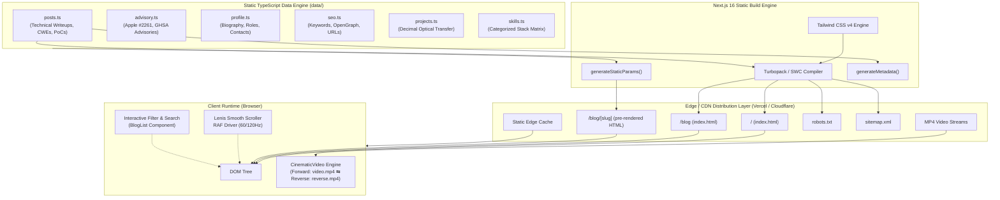

# 🏛 Architecture Manual — Madhan Alagarsamy Portfolio & Research Hub

This document details the architectural principles, component structure, rendering pipelines, and technical trade-offs behind the **Madhan Alagarsamy Technical Portfolio & Security Research Platform** ([`https://madhanalagarsamy.site`](https://madhanalagarsamy.site)).

---

## 📑 Table of Contents

- [1. Architectural Principles](#1-architectural-principles)
- [2. System Topology & Architecture Diagram](#2-system-topology--architecture-diagram)
- [3. Next.js 16 App Router & Component Boundaries](#3-nextjs-16-app-router--component-boundaries)
- [4. Static Site Generation (SSG) Pipeline](#4-static-site-generation-ssg-pipeline)
- [5. Motion & Canvas Architecture](#5-motion--canvas-architecture)
  - [5.1 Dual-Video Ping-Pong Canvas Engine](#51-dual-video-ping-pong-canvas-engine)
  - [5.2 Lenis Physics-Based Smooth Scroll Pipeline](#52-lenis-physics-based-smooth-scroll-pipeline)
  - [5.3 Framer Motion Viewport Revelations](#53-framer-motion-viewport-revelations)
- [6. Styling Paradigm & Design System (Tailwind CSS v4)](#6-styling-paradigm--design-system-tailwind-css-v4)
- [7. Data Layer & Type Safety System](#7-data-layer--type-safety-system)
- [8. Performance Architecture & Core Web Vitals](#8-performance-architecture--core-web-vitals)
- [9. Architectural Decision Records (ADRs)](#9-architectural-decision-records-adrs)

---

## 1. Architectural Principles

1. **Deterministic Edge Delivery**: Zero server-side runtime database latency. All routes (`/`, `/blog`, and all dynamic `/blog/[slug]`) compile to static HTML and JSON manifests during build time and are distributed globally across edge CDN points of presence (PoPs).
2. **Defensive Aesthetic & Cyber-Terminal Ergonomics**: Dark palette (`#000000` base, `#ffffff` accents, emerald `#10b981` status pulses, and `#0a0a0a` glassmorphism panels). Emphasizes technical rigor, verified advisories, and code clarity.
3. **Motion Without Friction**: Smooth interpolation via Lenis with strict adherence to `prefers-reduced-motion`. Background media uses hardware-accelerated transforms (`transform: translateZ(0)`) to isolate rendering layers from CPU paint cycles.
4. **Structured Semantic Truth**: Every technical asset, CVE disclosure, and career record is machine-readable via Schema.org JSON-LD definitions (`Person`, `TechArticle`, `ProfilePage`, `Blog`).

---

## 2. System Topology & Architecture Diagram



---

## 3. Next.js 16 App Router & Component Boundaries

The project strictly distinguishes between **React Server Components (RSC)** and **Client Components (`"use client"`)** to minimize bundle size:

### Server Component Tree
- `app/layout.tsx`: Root shell. Injects variable fonts, metadata base, and global Schema.org scripts. Never re-renders.
- `app/page.tsx`: Page skeleton for the single-page experience. Renders structural markup and passes serialized props to leaf client components.
- `app/blog/page.tsx`: Blog directory layout. Fetches blog posts synchronously at build time via `getAllPosts()` and supplies data to `BlogList`.
- `app/blog/[slug]/page.tsx`: Deep-dive technical article layout. Implements `generateStaticParams()` and `generateMetadata()`. Renders code blocks, CWE tags, and timelines.
- `app/robots.ts` & `app/sitemap.ts`: Dynamic metadata route handlers.

### Client Component Boundaries (`"use client"`)
Client components are isolated specifically where DOM interaction, browser APIs, or state tracking are needed:
- `components/CinematicVideo.tsx`: Direct video element manipulation, event listeners (`onEnded`, `onError`), and mobile touch gestures.
- `components/SmoothScroll.tsx`: Mounts Lenis, binds `requestAnimationFrame`, handles `prefers-reduced-motion`.
- `components/Navigation.tsx`: Tracks `window.scrollY` for frosted blur effects, handles smooth hash scrolling, and toggles mobile drawer state.
- `components/BlogList.tsx`: Manages client-side query string state and tag filtering array transformations.
- `components/Hero.tsx`, `components/About.tsx`, `components/SecurityAdvisory.tsx`, `components/FeaturedProject.tsx`: Framer Motion view-triggered entrance animations (`whileInView`).

---

## 4. Static Site Generation (SSG) Pipeline

All pages in the application are static. For dynamic routes (`/blog/[slug]`), Next.js 16 uses `generateStaticParams`:

```typescript
// app/blog/[slug]/page.tsx
export async function generateStaticParams() {
  const posts = getAllPosts();
  return posts.map((post) => ({
    slug: post.slug,
  }));
}
```

During `next build`:
1. Next.js discovers all 7 research post slugs from `data/posts.ts`.
2. The dynamic route `app/blog/[slug]/page.tsx` executes once for each slug.
3. `generateMetadata({ params })` executes to generate canonical tags, OpenGraph objects, and Twitter cards for each post.
4. The output is written to `.next/server/app/blog/[slug].html`.
5. Edge CDN caches these files permanently until the next deployment.

---

## 5. Motion & Canvas Architecture

### 5.1 Dual-Video Ping-Pong Canvas Engine

Standard video looping mechanisms in HTML5 have a noticeable frame freeze or jump at loop seams. The portfolio solves this via a dual-element alternating state machine:

```mermaid
stateDiagram-v2
    [*] --> ForwardPlaying: Initial Page Load

    state ForwardPlaying {
        Video1_Opacity: 100% (z-index 10)
        Video2_Opacity: 0% (z-index 0)
    }

    ForwardPlaying --> TransitionToReverse: Video 1 onEnded Event
    
    state TransitionToReverse {
        Reset_Video2: currentTime = 0
        Play_Video2: video2.play()
        Crossfade: 700ms CSS Opacity Transition
    }

    TransitionToReverse --> ReversePlaying: ActiveVideo = 2

    state ReversePlaying {
        Video1_Opacity: 0% (z-index 0)
        Video2_Opacity: 100% (z-index 10)
    }

    ReversePlaying --> TransitionToForward: Video 2 onEnded Event

    state TransitionToForward {
        Reset_Video1: currentTime = 0
        Play_Video1: video1.play()
        Crossfade: 700ms CSS Opacity Transition
    }

    TransitionToForward --> ForwardPlaying: ActiveVideo = 1
```

#### Autoplay Resilience
Modern mobile browsers (iOS Safari, Android Chrome) block unmuted or un-interacted autoplay. `CinematicVideo.tsx` catches the rejected `vid.play()` promise and attaches passive, once-only listeners:
```typescript
window.addEventListener("touchstart", handleMobileGesture, { passive: true, once: true });
window.addEventListener("scroll", handleMobileGesture, { passive: true, once: true });
window.addEventListener("click", handleMobileGesture, { passive: true, once: true });
```
When triggered, playback begins seamlessly without user interruption.

### 5.2 Lenis Physics-Based Smooth Scroll Pipeline

Native browser scrolling can feel stepped or erratic across varying trackpads and mouse wheels. We wrap the document in [`components/SmoothScroll.tsx`](../components/SmoothScroll.tsx):
- **Formula**: `easing: (t) => Math.min(1, 1.001 - Math.pow(2, -10 * t))`
- **Duration**: `1.2s`
- **Hardware Driver**: Bounded to the display vertical sync via `requestAnimationFrame(raf)`.
- **Accessibility**: Checks `window.matchMedia("(prefers-reduced-motion: reduce)").matches` and shuts off if requested.

### 5.3 Framer Motion Viewport Revelations

Sections utilize `whileInView` with a negative margin (`viewport={{ once: true, margin: "-80px" }}`):
- Animations execute exactly once per session.
- Sub-components stagger entrance (`staggerChildren: 0.12`).
- Renders transform and opacity properties exclusively (`transform: translateY(...)`), bypassing costly browser reflows.

---

## 6. Styling Paradigm & Design System (Tailwind CSS v4)

The project leverages **Tailwind CSS v4**:
- No complex `tailwind.config.js` required; configuration occurs via modern CSS directives in [`app/globals.css`](../app/globals.css):
  ```css
  @import "tailwindcss";

  @layer base {
    :root {
      --background: #000000;
      --foreground: #ffffff;
    }
  }
  ```
- **Dark Theme Exclusivity**: System is locked in high-contrast dark mode (`<html className="dark ...">`).
- **Typography**: Variable font integration via `next/font/google`:
  - `--font-geist-sans`: Crisp geometric sans-serif for headlines and narratives.
  - `--font-geist-mono`: Technical mono font for advisory IDs, CWE badges, metrics, and code.
- **Glassmorphism Layering**:
  - `bg-white/[0.02]` to `bg-white/[0.06]` backdrop panels.
  - `border-white/10` borders with emerald hover transitions (`hover:border-emerald-500/40`).

---

## 7. Data Layer & Type Safety System

Rather than maintaining an external CMS (Sanity, Strapi, Contentful) which introduces build-time network dependencies and rate limits, data is modeled as pure, immutable TypeScript structures in `data/`:

| Module | Schema Interface | Content Responsibility |
| :--- | :--- | :--- |
| `data/posts.ts` | `BlogPost`, `SectionBlock`, `CodeBlock`, `TimelineEntry` | Vulnerability writeups, PoCs, remediation code, references. |
| `data/advisory.ts`| `AdvisoryItem` | Disclosed vulnerabilities, CWE tags, Apple PR fix links. |
| `data/profile.ts` | `profileData` | Biographical narrative, roles, Net Corporation details. |
| `data/projects.ts`| `featuredProjectData` | Decimal Optical Transfer specifications and metrics. |
| `data/seo.ts` | `SEO_CONFIG`, `SITE_URL` | Canonical URLs, title templates, keyword indexing arrays. |
| `data/skills.ts` | `SkillCategory` | 5-tier technical taxonomy. |
| `data/experience.ts`| `ExperienceItem` | Professional and founder history. |
| `data/education.ts` | `EducationItem` | Academic degrees and university affiliations. |

---

## 8. Performance Architecture & Core Web Vitals

To maintain optimal Lighthouse scores (100/100):
1. **Asset Compression**:
   - Background videos are compressed using H.264/MP4 (`video.mp4` is 1.9MB; `reverse.mp4` is 1.8MB).
   - Post cover images are optimized JPEG assets generated at exact 1376x768 dimensions.
2. **Font Optimization**:
   - `next/font/google` downloads font files at build time and inlines critical font declarations, avoiding Google Fonts external network roundtrips.
3. **Cumulative Layout Shift (CLS = 0.00)**:
   - Fixed aspect ratios on media containers (`aspect-video`, `h-[100dvh]`).
   - Fonts use `display: "swap"` with zero layout shift font metrics matching fallback system fonts.

---

## 9. Architectural Decision Records (ADRs)

### ADR 001: Next.js 16 Static Generation (SSG) over Headless CMS
- **Status**: Accepted
- **Context**: The portfolio documents high-severity security vulnerabilities and research writeups. High availability, zero downtime, and edge speed are critical.
- **Decision**: Store all writeups as strongly typed TypeScript objects and compile to static HTML via `generateStaticParams()`.
- **Consequence**: Ultra-fast load times globally, immunity to CMS database injection attacks, and simplified version control (git commits track both code and articles).

### ADR 002: Lenis over Native CSS `scroll-behavior: smooth`
- **Status**: Accepted
- **Context**: Native CSS smooth scrolling lacks consistent cross-browser momentum physics and conflicts with viewport animation triggers.
- **Decision**: Adopt Lenis with `requestAnimationFrame` driver and a custom exponential decay easing curve.
- **Consequence**: Fluid, premium motion feeling across macOS, Windows, and Linux trackpads/wheels, while respecting user accessibility switches.

### ADR 003: Dual-Video Alternating Canvas over Single Looped `<video>`
- **Status**: Accepted
- **Context**: Single HTML5 `<video loop>` elements pause for 100-300ms when jumping from end-to-start, creating a visible seam.
- **Decision**: Mount two video elements (one forward, one reversed) and crossfade opacities on the `onEnded` event.
- **Consequence**: Infinite, seamless ambient breathing loop with zero visual hitching.

---

*Authored by Madhan Alagarsamy. Maintained under the architecture repository of [`https://madhanalagarsamy.site`](https://madhanalagarsamy.site).*
